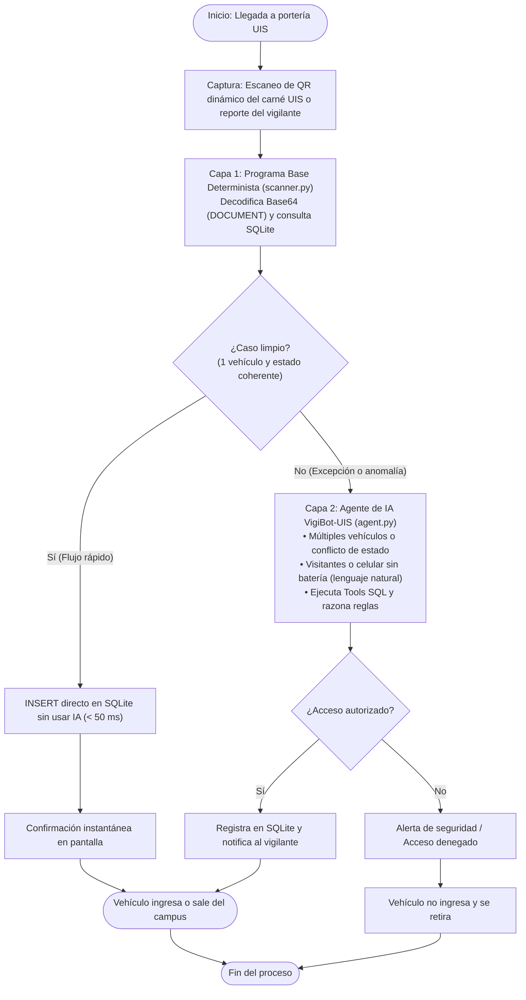

```mermaid
flowchart TD
    A(["Inicio: Llegada a portería UIS"]) --> B["Captura: Escaneo de QR dinámico del carné UIS o reporte del vigilante"]
    B --> C["Capa 1: Programa Base Determinista (scanner.py)<br/>Decodifica Base64 (DOCUMENT) y consulta SQLite"]
    C --> D{"¿Caso limpio?<br/>(1 vehículo y estado coherente)"}
    
    D -- "Sí (Flujo rápido)" --> E["INSERT directo en SQLite sin usar IA (< 50 ms)"]
    E --> F["Confirmación instantánea en pantalla"]
    F --> G(["Vehículo ingresa o sale del campus"])
    
    D -- "No (Excepción o anomalía)" --> H["Capa 2: Agente de IA VigiBot-UIS (agent.py)<br/>• Múltiples vehículos o conflicto de estado<br/>• Visitantes o celular sin batería (lenguaje natural)<br/>• Ejecuta Tools SQL y razona reglas"]
    H --> I{"¿Acceso autorizado?"}
    
    I -- "Sí" --> J["Registra en SQLite y notifica al vigilante"]
    J --> G
    
    I -- "No" --> K["Alerta de seguridad / Acceso denegado"]
    K --> L["Vehículo no ingresa y se retira"]
    L --> M(["Fin del proceso"])
    G --> M
```
